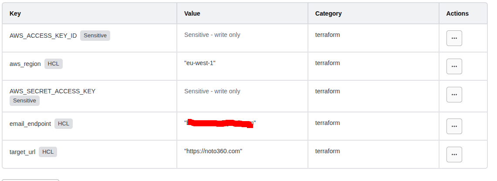

# Serverless Website Health Checker (AWS + Terraform)

This project deploys a serverless health-monitoring system on AWS using Terraform. It leverages an AWS Lambda function, triggered every 5 minutes by Amazon EventBridge (CloudWatch Events), to perform an HTTP health check on a specified URL. 

Notifications regarding the website's status are sent via an Amazon SNS Topic. Execution results are persisted in an Amazon DynamoDB table, which are then retrieved by a secondary Lambda function to generate a status report hosted in an Amazon S3 bucket.

## Architecture


## Workflow
1. **EventBridge**: Triggers the "Checker" Lambda function on a 5-minute schedule.
2. **Lambda (Checker)**: Executes an HTTP request and evaluates the response.
3. **SNS**: Dispatches alerts if the health check fails or the site is unreachable.
4. **DynamoDB**: Stores historical check data (status codes, timestamps, and latency).
5. **Lambda (Reporter)**: Queries DynamoDB to aggregate uptime data.
6. **S3 Bucket**: Hosts the final output for visualization.

## Results


## Deployment

### 1. Configure Workspace Variables
Terraform Cloud requires specific variables to manage your infrastructure. 

1. Navigate to your workspace: **`website_check_serverless`**.
2. Go to the **Variables** tab.
3. Add the following under the **Terraform variables** section:

| Variable | Description | Example |
| :--- | :--- | :--- |
| `aws_region` | The AWS region to deploy resources. | `eu-west-1` |
| `target_url` | The URL you want to monitor. | `https://example.com` |
| `email_endpoint` | Email address for alert notifications. | `devops@example.com` |



### 2. Initialize Terraform
Open your terminal in the project root and run the initialization command. This will connect to Terraform Cloud and download the necessary AWS providers.

```bash
terraform init
```

### 3. Plan and apply 

```bash
terraform plan

terraform apply -auto-approve
```