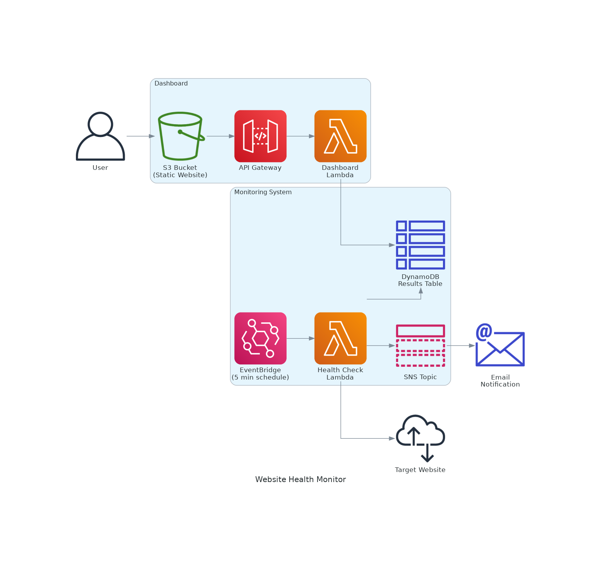
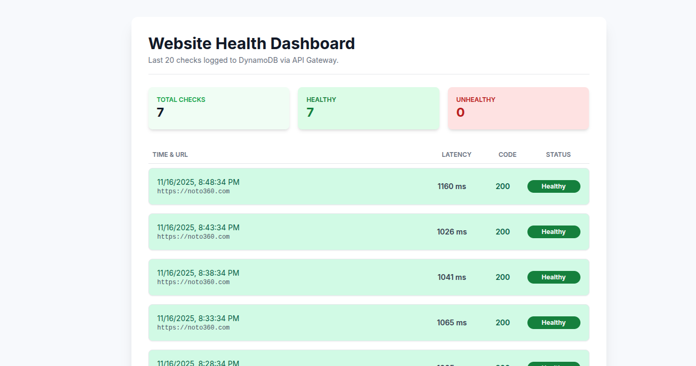

# Serverless Website Health Checker (AWS + Terraform)

This project deploys a serverless health-checking system on AWS using Terraform. It leverages an AWS Lambda function, triggered periodically by Amazon EventBridge (CloudWatch Events), to perform an HTTP health check on a specified URL. Notifications regarding the website's health are sent via an Amazon SNS Topic.

## Architecture

## Results

